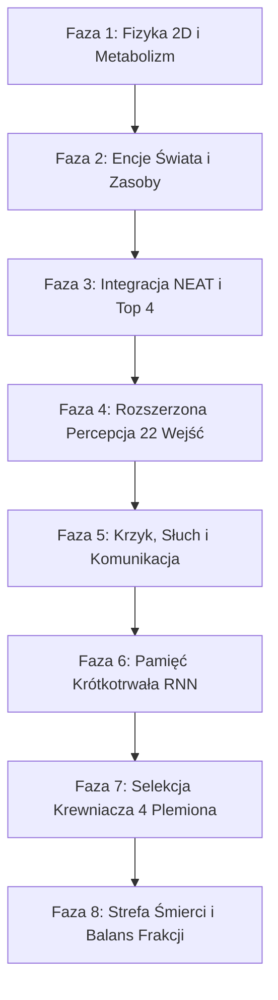

# 🧬 Dokumentacja Techniczna & Rejestr Ewolucji Systemu: AgentReinforcementLearning

> **Projekt Badawczy ALife & Neuroewolucja NEAT (RNN) w Pygame**  
> **Status:** Faza 8 zakończona sukcesem | **Pokrycie testami:** 66 testów jednostkowych (100% PASS, TDD)

---

## 1. Architektura Systemowa i Zasady Inżynieryjne

Projekt **AgentReinforcementLearning** stanowi środowisko badawcze sztucznego życia (Artificial Life), którego celem jest obserwacja emergencji ról społecznych, podziału pracy, altruizmu krewniaczego oraz taktyk wojennych wśród populacji agentów sterowanych przez ewoluujące sieci neuronowe (NEAT).

### 1.1. Główne Założenia Architektoniczne
1. **Izolacja Logiki od Prezentacji (Separation of Concerns):**  
   Fizyka, matematyka wektorowa 2D, metabolizm oraz neuroewolucja są w 100% odseparowane od procedur renderowania Pygame. Pozwala to na wykonywanie pełnego zestawu testów jednostkowych w trybie bezgłowym (`headless`, `SDL_VIDEODRIVER=dummy`) w czasie poniżej 1.5 sekundy.
2. **Minimalizm Zależności (Zero Over-Importing):**  
   System opiera się wyłącznie na standardowej bibliotece Pythona (`math`, `random`, `time`, `unittest`), bibliotece `neat-python` oraz zoptymalizowanym module `pygame.math.Vector2`. Brak ciężkich zależności zewnętrznych (NumPy, SciPy, Pandas).
3. **Zarządzanie Pamięcią i Wydajność:**  
   Wszelkie zasoby graficzne, czcionki monospace oraz półprzezroczyste powierzchnie (w tym nakładki i czerwona ramka Strefy Śmierci) są alokowane jednorazowo w konstruktorach, eliminując wycieki pamięci i spadki FPS przy intensywnych symulacjach.

---

## 2. Chronologiczny Rejestr Faz Ewolucji Projektu (Roadmapa Faz 1 – 8)

Poniższy rejestr dokumentuje kolejne etapy rozwoju ekosystemu, motywacje inżynieryjne oraz wprowadzone innowacje.



### 🔹 Faza 1: Fundamenty Środowiska i Kinematyka 2D
- **Zakres:** Utworzenie pętli symulacji Pygame w rozdzielczości 1600x720 (arena 1280px + panel 320px).
- **Mechanika:** Kinematyka ciągła oparta na wektorach `pygame.math.Vector2`, prędkości maksymalnej ($V_{max} = 4.0$) oraz bezwładności ($a \cdot 0.8$).
- **Metabolizm bazowy:** Koszt energetyczny każdego kroku ($E_{cost} = 0.20$ energii/klatkę).

### 🔹 Faza 2: Encje Ekologiczne i Cykl Życia
- **Zakres:** Modularne klasy encji świata w `src/entities.py`: `Food`, `Poison`, `Hazard`.
- **Mechanika:** 
  - `Food` (zielone jabłka): +65.0 energii, respawn w losowym miejscu areny.
  - `Poison` (fioletowe kwadraty): -35.0 energii, natychmiastowe uszkodzenie witalności.
  - `Hazard` (ruchome czerwone kule): wędrujący drapieżnicy odbijający się od ścian, zadający 20.0 obrażeń przy kolizji.

### 🔹 Faza 3: Neuroewolucja NEAT i Elitaryzm Top 4
- **Zakres:** Integracja `neat-python`, konfiguracja `config-feedforward.txt`.
- **Mechanika:**
  - Początkowy minimalizm topologii (0 neuronów ukrytych, `full_direct`).
  - Elitaryzm Top 4: zachowanie 4 najlepszych genomów bez mutacji.
  - Bezpośrednie przypisywanie `genome.fitness` z pętli ewaluacji.

### 🔹 Faza 4: Rozszerzona Przestrzeń Percepcyjna (22 Sensory)
- **Zakres:** Rozbudowa percepcji agenta do 22 znormalizowanych sygnałów wejściowych.
- **Sensory:** Dystanse i wektory kierunkowe do 2 najbliższych jabłek, najbliższej trucizny, zagrożenia, odległość do ścian (`dist_to_wall`) oraz poziom energii własnej.
- **Efekt:** Agenci nauczyli się omijać przeszkody i aktywnie nawigować w stronę skupisk pożywienia.

### 🔹 Faza 5: Komunikacja Akustyczna (Krzyk i Słuch) oraz Obrona Stadna
- **Zakres:** Wprowadzenie komunikacji wewnątrzpopulacyjnej (25 wejść sensorycznych, 3 wyjścia akcji).
- **Mechanika:**
  - Wyjście #3 (`Shout`): emisja fali dźwiękowej (`outputs[2] > 0.0`), kosztująca dodatkowe 0.20 energii/klatkę.
  - Sensory #23-#25: wektor kierunku oraz dystans do najbliższego krzyczącego osobnika.
  - Obrona stadna: obecność sojuszników w promieniu 45px odstrasza agresorów i zadaje obrażenia kontrataku.

### 🔹 Faza 6: Pamięć Krótkotrwała (RNN) i Holistyczny Fitness
- **Zakres:** Przejście z architektury feed-forward na sieci rekurencyjne (`feed_forward = False` w NEAT).
- **Mechanika RNN:** Powstanie samowzbudzających się pętli synaptycznych zachowujących stan pamięci (np. pamięć o znikającym zagrożeniu).
- **Holistyczna funkcja fitnessu:**
  $$F_{total} = \left( \frac{\text{frames\_alive} \times F_{akcje}}{25.0} \right) \times M_{death}$$
  gdzie $F_{akcje} = 1.0 \times \text{jablka} + 1.0 \times \text{obrony} + 2.0 \times \text{ataki} + 3.0 \times \text{altruizm}$, a $M_{death}$ karze zgon krawędziowy ($0.3$) lub głodowy ($0.7$), nagradzając przetrwanie epoki ($1.2$).

### 🔹 Faza 7: Selekcja Krewniacza i Wojny Plemion (Kin Selection)
- **Zakres:** Podział populacji na 4 frakcje (Plemię 1: Cyjan, Plemię 2: Magenta, Plemię 3: Żółty, Plemię 4: Biały).
- **Zasady Społeczne:**
  - **Altruizm (+50.0 fit):** Dozwolony wyłącznie wewnątrz własnego plemienia ($E > 50 \to E < 20$, transfer 20.0 energii).
  - **Zakaz kanibalizmu:** Brak możliwości atakowania pobratymców.
  - **Drapieżnictwo międzyplemienne (+25.0 fit, +25.0 energii):** Polowanie na samotnych wrogów od tyłu.
  - **Obrona stadna:** Sojusznicy z tego samego plemienia chronią ofiarę przed wrogim drapieżnikiem.

### 🔹 Faza 8: Eliminacja "Corner Exploitu", Strefa Śmierci i Balans Plemion (BIEŻĄCA)
- **Problem badawczy:** Agenci wyewoluowali niepożądane zachowanie pasożytnicze ("Corner Exploit") – tłoczyły się w rogach areny przy ścianach, blokując się nawzajem i sztucznie farmiąc punkty za kolizje i obronę przy zerowym ryzyku spotkania drapieżników. Dodatkowo losowy podział plemion tworzył asymetrię liczebną frakcji.
- **Wdrożone Rozwiązania:**
  1. **Strefa Śmierci (Deadly Margin = 20px):**
     - Każdy agent, którego środek znajduje się w odległości $< 20\text{ px}$ od dowolnej z czterech ścian areny (po upływie Grace Period $\ge 60$ klatek), podlega drastycznemu drenażowi witalnemu: **$-2.0$ energii w każdej klatce**.
     - Agent przebywający w rogu ginie w zaledwie ułamku sekundy ($\le 5-10$ klatek), a jego zgon otrzymuje mnożnik kary $M_{death} = 0.3$.
  2. **Pre-renderowana Wizualizacja Pygame:**
     - W `Environment.__init__` generowana jest jednorazowo półprzezroczysta czerwona ramka `deadly_zone_surface` (kolor `(231, 76, 60, 50)` oraz obrys `(231, 76, 60, 140)`), bez alokacji pamięci w pętli renderowania.
  3. **Balans Populacji i Frakcji (`pop_size = 40`):**
     - Wielkość populacji w `config-feedforward.txt` została zmieniona z 50 na 40.
     - W metodzie `eval_generation()` przypisywanie plemion odbywa się deterministycznie: `tribe_id = (i % 4) + 1`. Gwarantuje to **idealną równowagę sił: dokładnie po 10 agentów w każdym z 4 plemion**.
  4. **Strojenie Mutacji Topologii RNN (`node_add_prob = 0.15`):**
     - Podniesienie prawdopodobieństwa dodawania węzłów z 0.05 na 0.15 ułatwia powstawanie nowych neuronów ukrytych tworzących rekurencyjne pętle pamięciowe bez degeneracji sieci.

---

## 3. Specyfikacja Przestrzeni Sensoryczno-Motorycznej (25 Wejść / 3 Wyjścia)

| Nr | Etykieta Sensora | Zakres | Rola Ekologiczna / Zastosowanie w RNN |
|:--:|:-----------------|:------:|:--------------------------------------|
| **0** | `Vel X` | `[-1.0, 1.0]` | Pęd poziomy agenta znormalizowany do $V_{max}$ |
| **1** | `Vel Y` | `[-1.0, 1.0]` | Pęd pionowy agenta znormalizowany do $V_{max}$ |
| **2** | `Food #1 Dist` | `[0.0, 1.0]` | Euklidesowy dystans do najbliższego jabłka |
| **3-4** | `Food #1 Dir (X, Y)` | `[-1.0, 1.0]` | Znormalizowany wektor kierunku do pożywienia #1 |
| **5** | `Food #2 Dist` | `[0.0, 1.0]` | Dystans do 2. pożywienia (planowanie trajektorii) |
| **6-7** | `Food #2 Dir (X, Y)` | `[-1.0, 1.0]` | Znormalizowany wektor kierunku do pożywienia #2 |
| **8** | `Poison Dist` | `[0.0, 1.0]` | Dystans do najbliższej fioletowej trucizny |
| **9-10**| `Poison Dir (X, Y)` | `[-1.0, 1.0]` | Wektor repulsji od trucizny |
| **11** | `Hazard Dist` | `[0.0, 1.0]` | Dystans do ruchomego drapieżcy |
| **12-13**|`Hazard Dir (X, Y)` | `[-1.0, 1.0]` | Wektor uniku przed ruchomym zagrożeniem |
| **14** | `Enemy Dist` | `[0.0, 1.0]` | Dystans do najbliższego wroga (`other.tribe_id != self.tribe_id`) |
| **15-16**|`Enemy Dir (X, Y)` | `[-1.0, 1.0]` | Wektor namierzania wrogiego plemienia |
| **17** | `Ally Critical` | `{0.0, 1.0}` | Stan krytyczny sojusznika ($E < 20\%$ w tym samym plemieniu) |
| **18** | `Enemy Heading` | `[-1.0, 1.0]` | Zwrot wroga ($>0$ ucieka tyłem, $<0$ szarża czołowa) |
| **19** | `Tribe Density` | `[0.0, 1.0]` | Gęstość sojuszników z własnego plemienia w promieniu 60px |
| **20** | `Wall Dist` | `[0.0, 1.0]` | Dystans do ściany ($0.0$ przy ścianie, $1.0$ w centrum) |
| **21** | `Energy Level` | `[0.0, 1.0]` | Poziom rezerwy energii życiowej agenta |
| **22** | `Shout Dist` | `[0.0, 1.0]` | Dystans do najbliższego agenta emitującego krzyk |
| **23-24**|`Shout Dir (X, Y)` | `[-1.0, 1.0]` | Wektor kierunku słuchowego do źródła krzyku |

### Wyjścia Motoryczne i Behawioralne:
- **Wyjście 0 (`Accel X`):** Siła przyspieszenia poziomego $[-1.0, 1.0]$ (`tanh`).
- **Wyjście 1 (`Accel Y`):** Siła przyspieszenia pionowego $[-1.0, 1.0]$ (`tanh`).
- **Wyjście 2 (`Shout`):** Aktywacja akustyczna gdy $> 0.0$ (koszt: $0.20$ energii/klatkę).

---

## 4. Matematyka Fizyki, Metabolizmu i Bilansu Energii

1. **Metabolizm Całkowity w Klatce:**
   $$E_{\text{drain}} = 0.20 + \left(\frac{v}{V_{max}}\right)^2 \times 0.08 + (0.20 \text{ jeśli Shout}) + E_{\text{border}}$$
   gdzie:
   $$E_{\text{border}} = \begin{cases} 
   2.0 & \text{jeśli } \text{frames} \ge 60 \text{ oraz w Strefie Śmierci } (< 20\text{px}) \\ 
   0.5 & \text{jeśli } \text{frames} \ge 60 \text{ oraz w strefie ostrzegawczej } (< 50\text{px}) \\ 
   0.0 & \text{w bezpiecznym centrum areny} 
   \end{cases}$$

2. **Czas Przetrwania w Strefie Śmierci (Corner Kill):**
   Agent w rogu o energii $E = 10.0$ traci $2.20$ energii/klatkę. Zgon następuje w czasie:
   $$t = \frac{10.0}{2.20} \approx 4.54 \text{ klatki } (\approx 0.07\text{ s przy 60 FPS})$$
   Całkowicie uniemożliwia to pasożytowanie na krawędziach areny.

---

## 5. Zapewnienie Jakości (Quality Assurance & TDD)

Projekt objęty jest kompletnym zestawem **66 testów jednostkowych** podzielonych na moduły logiczne:
- `tests/test_config.py` (4 testy): Poprawność konfiguracji NEAT, parametry RNN, elitaryzm Top 4, `pop_size = 40`, `node_add_prob = 0.15`.
- `tests/test_agent.py` (34 testy): Sensoryka, metabolizm sprintu i krzyku, Grace Period, kin selection, drapieżnictwo, obrona stadna, altruizm, drenaż Strefy Śmierci we wszystkich 4 krawędziach, likwidacja corner exploitu.
- `tests/test_environment.py` (15 testów): Cykl generacji, rendering headless, obsługa zdarzeń, Inspektor Sieci deepcopy, pre-renderowana ramka Strefy Śmierci, idealny podział 4x10 plemion.
- `tests/test_entities.py` (5 testów): Pozycjonowanie, granice areny, respawn pożywienia i trucizn, odbijanie drapieżców.
- `tests/test_stats.py` (8 testów): Śledzenie metryk, statystyki generacji, zapis i dopisywanie do `logs/logs.txt`, auto-tworzenie folderu, rotacja rozmiaru oraz obsługa ręcznej archiwizacji.

Wszystkie testy uruchamiane są poleceniem:
```powershell
python -m unittest discover tests -v
```
i wykonują się w czasie ~1.4 sekundy.
