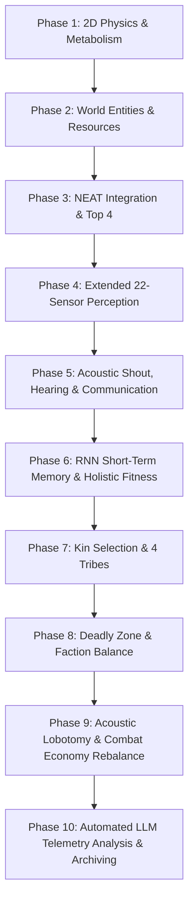

# 🧬 Technical Documentation & System Evolution Log: AgentReinforcementLearning

> **ALife Research Project & NEAT Neuroevolution (RNN) in Pygame**  
> **Status:** Phase 10 (Automated Telemetry Analysis & Archiving) completed | **Test Coverage:** 86 unit tests (100% PASS, TDD)

---

## 1. System Architecture & Engineering Principles

The **AgentReinforcementLearning** project is an Artificial Life (ALife) research environment designed to study the emergence of social roles, division of labor, kin selection altruism, and combat tactics within a population of agents controlled by evolving neural networks (NEAT).

### 1.1. Core Architectural Tenets
1. **Separation of Concerns (Logic vs. Presentation):**  
   2D vector physics, kinematics, metabolism, and neuroevolution are 100% decoupled from Pygame rendering routines. This enables running the entire test suite headlessly (`SDL_VIDEODRIVER=dummy`) in under 1.5 seconds.
2. **Minimalist Dependencies (Zero Over-Importing):**  
   The system relies strictly on the Python standard library (`math`, `random`, `time`, `unittest`), the `neat-python` package, and the optimized `pygame.math.Vector2` module. No heavy external dependencies (NumPy, SciPy, Pandas).
3. **Memory Management & Steady Frame Rates:**  
   All graphical assets, monospace fonts, and semi-transparent surfaces (including HUD overlays and the Deadly Zone red border) are allocated once during class initialization, preventing memory leaks and FPS drops during high-speed evolution.

---

## 2. Chronological Evolution Roadmap (Phases 1 – 10)

The following log documents the evolutionary milestones, engineering motivations, and key innovations implemented throughout the project.



### 🔹 Phase 1: Environment Foundations & 2D Kinematics
- **Scope:** Pygame simulation loop in 1600x720 resolution (1280px arena + 320px telemetry sidebar).
- **Mechanics:** Continuous 2D kinematics utilizing `pygame.math.Vector2`, maximum velocity ($V_{max} = 4.0$), and inertia dampening ($a \cdot 0.8$).
- **Base Metabolism:** Per-step metabolic energy cost ($E_{cost} = 0.20$ energy/frame).

### 🔹 Phase 2: Ecological Entities & Life Cycle
- **Scope:** Modular world entity classes in `src/entities.py`: `Food`, `Poison`, `Hazard`.
- **Mechanics:** 
  - `Food` (green apples): +65.0 energy, respawns randomly across the arena.
  - `Poison` (purple squares): -35.0 energy, immediate health detriment.
  - `Hazard` (moving red spheres): wandering predators bouncing off walls, inflicting 20.0 damage upon collision.

### 🔹 Phase 3: NEAT Neuroevolution & Top 4 Elitism
- **Scope:** Integration of `neat-python`, configuration via `config-feedforward.txt`.
- **Mechanics:**
  - Initial topological minimalism (0 hidden neurons, direct input-output connections).
  - Top 4 Elitism: preservation of the 4 highest-performing genomes without mutation.
  - Direct assignment of `genome.fitness` from the evaluation loop.

### 🔹 Phase 4: Extended Sensory Perception (22 Sensors)
- **Scope:** Expansion of agent perception to 22 normalized continuous input signals.
- **Sensors:** Distances and direction vectors to the 2 nearest apples, nearest poison, nearest hazard, distance to walls (`dist_to_wall`), and internal energy reserves.
- **Outcome:** Agents learned obstacle avoidance and targeted foraging toward food clusters.

### 🔹 Phase 5: Acoustic Communication (Shout & Hearing) & Herd Defense
- **Scope:** Intra-population acoustic communication (25 sensory inputs, 3 action outputs).
- **Mechanics:**
  - Output #3 (`Shout`): sound wave broadcast (`outputs[2] > 0.0`), costing an extra 0.20 energy/frame.
  - Sensors #23-#25: direction vector and distance to the nearest shouting peer.
  - Herd Defense: the presence of nearby allies within 45px repels aggressors and inflicts counterattack damage.

### 🔹 Phase 6: Short-Term Memory (RNN) & Holistic Fitness
- **Scope:** Transition from feed-forward networks to recurrent neural networks (`feed_forward = False` in NEAT).
- **RNN Mechanics:** Self-exciting synaptic feedback loops retaining hidden state memory (e.g., memorizing recently seen threats).
- **Holistic Fitness Function:**
  $$F_{total} = \left( \frac{\text{frames\_alive} \times F_{actions}}{25.0} \right) \times M_{death}$$
  where $F_{actions} = 1.0 \times \text{foods} + 1.0 \times \text{defenses} + 2.0 \times \text{attacks} + 3.0 \times \text{altruism}$, and $M_{death}$ penalizes edge deaths ($0.3$) or starvation ($0.7$), rewarding generational survival ($1.2$).

### 🔹 Phase 7: Kin Selection & Tribal Warfare (Kin Selection)
- **Scope:** Population division into 4 distinct tribes (Tribe 1: Cyan, Tribe 2: Magenta, Tribe 3: Yellow, Tribe 4: White).
- **Social Rules:**
  - **Altruism (+50.0 fit):** Permitted exclusively within one's own tribe ($E > 50 \to E < 20$, transferring 20.0 energy).
  - **Cannibalism Prohibition:** Inability to attack tribe members.
  - **Inter-Tribal Predation (+25.0 fit, +25.0 energy):** Hunting isolated enemies from behind.
  - **Herd Defense:** Tribe members protect victims against enemy predators.

### 🔹 Phase 8: Elimination of "Corner Exploits", Deadly Zone & Faction Balance
- **Research Problem:** Agents evolved an undesirable parasitic behavior ("Corner Exploit") – clustering in arena corners against walls, jamming each other to artificially farm collision and defense scores with zero predation risk. Additionally, randomized tribe assignment created numerical asymmetries between factions.
- **Implemented Solutions:**
  1. **Deadly Margin (20px):**
     - Any agent whose center is $< 20\text{ px}$ from any of the four arena boundaries (after the Grace Period $\ge 60$ frames) suffers an aggressive vital drain: **$-2.0$ energy every single frame**.
     - An agent camping in a corner perishes in a fraction of a second ($\le 5-10$ frames) with a heavy penalty multiplier $M_{death} = 0.3$.
  2. **Pre-rendered Pygame Visualization:**
     - `Environment.__init__` constructs a pre-rendered semi-transparent red border `deadly_zone_surface` (fill color `(231, 76, 60, 50)`, outline `(231, 76, 60, 140)`), eliminating runtime surface allocations.
  3. **Population & Tribal Balance (`pop_size = 40`):**
     - Population size in `config-feedforward.txt` adjusted from 50 to 40.
     - In `eval_generation()`, tribe assignment is deterministic: `tribe_id = (i % 4) + 1`. This guarantees an **exact balance of power: precisely 10 agents in each of the 4 tribes**.
  4. **RNN Topology Mutation Tuning (`node_add_prob = 0.15`):**
     - Increasing node addition probability from 0.05 to 0.15 facilitates the growth of recurrent hidden nodes and feedback loops without network bloat.

### 🔹 Phase 9: Acoustic Lobotomy & Combat Economy Rebalance
- **Research Problem:** Neural brain dumps and evolutionary telemetry revealed a population collapse into a "micro-farming" local optimum. The acoustic shout mechanic was evolutionarily unviable (agents actively suppressed the output to conserve vital energy), while agents survived by jamming into dense collision clusters to farm collision and defense points rather than hunting or foraging.
- **Implemented Solutions:**
  1. **Acoustic Lobotomy (22 Inputs / 2 Outputs):**
     - Excised the 3 auditory sensors (`Nearest Shout Dist`, `Nearest Shout Dir X`, `Nearest Shout Dir Y`) and the `Acoustic Shout` action output.
     - Pruned architecture strictly to 22 normalized sensory inputs and 2 locomotive motor outputs (`Accel X`, `Accel Y`).
     - Removed the `-0.20` energy penalty for shouting and synchronized the Neural Inspector UI rendering logic to prevent `IndexError`.
  2. **Combat Cooldown (Anti-Micro-Farming):**
     - Introduced `self.combat_cooldown = 30` (0.5s at 60 FPS) applied upon any successful attack, frontal defense, or herd defense.
     - While `combat_cooldown > 0`, agents are barred from gaining fitness points or stolen energy from combat collisions (damage is still sustained), eliminating parasitic collision micro-farming.
  3. **Foraging Economy Buff (+40.0 Fitness):**
     - Increased nominal foraging fitness reward from +15.0 to +40.0 to strongly motivate exploration across the arena.

### 🔹 Phase 10: Automated LLM Telemetry Analysis & Archiving Pipeline (`analyze.py`) (CURRENT)
- **Research Problem:** Manual inspection of raw multi-generation telemetry (`logs/logs.txt`) and mathematical neural topologies (`logs/brain_id_{key}.txt`) is time-intensive and risks cognitive bias. Furthermore, unarchived `.txt` files accumulate in `logs/` root, creating clutter across multiple experimental sessions.
- **Implemented Solutions:**
  1. **Automated AI Architect & Neuroevolution Specialist Pipeline (`analyze.py`):**
     - Implemented an automated analysis script leveraging Google Gemini (`gemini-3.6-flash` with automatic fallback sequence to `gemini-3.5-flash`, `gemini-flash-latest`, and `gemini-2.5-flash`).
     - Standalone `.env` parser (zero mandatory third-party dotenv dependencies) reading `GEMINI_API_KEY` (or `GOOGLE_API_KEY`).
     - Direct HTTP REST communication via Python `requests` with robust error handling (authentication failures, rate quotas, network timeouts).
  2. **File Gathering & Token Optimization:**
     - Scans `logs/` root exclusively for active `.txt` logs and `brain_id_*.txt` brain dumps, strictly skipping existing subdirectories to avoid reprocessing older sessions.
     - Gracefully truncates oversized generation tables while preserving the header run summary and the latest 1,000 generations.
  3. **Targeted Neuroevolution Master Prompt & KaTeX Compatibility:**
     - Injects complete Phase 9 architectural parameters (22 sensors, 2 locomotive outputs, 4 balanced tribes, 30-frame combat cooldown, deadly border penalty, action-weighted fitness function).
     - Directs Gemini to generate a four-part executive diagnostic: *Population Evolutionary Health & Dynamics*, *Behavioral Telemetry & Emergence*, *Reverse-Engineered Neural Topologies*, and *Architectural Recommendations*.
     - Enforces strict KaTeX math formatting constraints (forbidding unescaped underscores in `\text{...}` blocks) to ensure seamless formula rendering in GitHub Markdown.
  4. **Unified Timestamping, Local Raw Archiving & Version-Controlled Benchmarks:**
     - Generates a unified timestamp string formatted as `DD-MM-YYYY_HH-MM` (e.g., `05-09-2026_15-30`).
     - **Raw Data Archiving (local and git-ignored):** Moves all processed root `.txt` telemetry and brain dumps into `logs/{timestamp}-LogsArchive/` using `shutil.move` only after the AI response is successfully received.
     - **Compiled Benchmark Reports (version-controlled):** Saves the LLM-generated executive analysis report directly to `benchmarks/{timestamp}-AnalyticsSummary.md`, establishing an empirical, version-controlled repository of scientific milestones.

---

## 3. Sensory-Motor Space Specification (22 Inputs / 2 Outputs)

| # | Sensory Label | Range | Ecological Role / RNN Application |
|:--:|:-----------------|:------:|:--------------------------------------|
| **0** | `Vel X` | `[-1.0, 1.0]` | Agent horizontal momentum normalized to $V_{max}$ |
| **1** | `Vel Y` | `[-1.0, 1.0]` | Agent vertical momentum normalized to $V_{max}$ |
| **2** | `Food #1 Dist` | `[0.0, 1.0]` | Euclidean distance to nearest apple |
| **3-4** | `Food #1 Dir (X, Y)` | `[-1.0, 1.0]` | Normalized direction vector to food #1 |
| **5** | `Food #2 Dist` | `[0.0, 1.0]` | Distance to 2nd food item (trajectory planning) |
| **6-7** | `Food #2 Dir (X, Y)` | `[-1.0, 1.0]` | Normalized direction vector to food #2 |
| **8** | `Poison Dist` | `[0.0, 1.0]` | Distance to nearest purple poison |
| **9-10**| `Poison Dir (X, Y)` | `[-1.0, 1.0]` | Repulsion vector from poison |
| **11** | `Hazard Dist` | `[0.0, 1.0]` | Distance to moving predator |
| **12-13**|`Hazard Dir (X, Y)` | `[-1.0, 1.0]` | Avoidance vector from moving hazard |
| **14** | `Enemy Dist` | `[0.0, 1.0]` | Distance to nearest enemy (`other.tribe_id != self.tribe_id`) |
| **15-16**|`Enemy Dir (X, Y)` | `[-1.0, 1.0]` | Targeting vector toward enemy tribe |
| **17** | `Ally Critical` | `{0.0, 1.0}` | Ally in critical state ($E < 20\%$ within same tribe) |
| **18** | `Enemy Heading` | `[-1.0, 1.0]` | Enemy orientation ($>0$ fleeing/back exposed, $<0$ head-on charge) |
| **19** | `Tribe Density` | `[0.0, 1.0]` | Ally density from own tribe within 60px radius |
| **20** | `Wall Dist` | `[0.0, 1.0]` | Distance to boundary ($0.0$ at wall, $1.0$ at arena center) |
| **21** | `Energy Level` | `[0.0, 1.0]` | Remaining vital energy reserve |

### Motor & Behavioral Outputs:
- **Output 0 (`Accel X`):** Horizontal acceleration force $[-1.0, 1.0]$ (`tanh`).
- **Output 1 (`Accel Y`):** Vertical acceleration force $[-1.0, 1.0]$ (`tanh`).

---

## 4. Physics, Metabolism & Energy Balance Mathematics

1. **Total Frame Energy Metabolism:**
   $$E_{\text{drain}} = 0.20 + \left(\frac{v}{V_{max}}\right)^2 \times 0.08 + E_{\text{border}}$$
   where:
   $$E_{\text{border}} = \begin{cases} 
   2.0 & \text{if } \text{frames} \ge 60 \text{ and inside Deadly Zone } (< 20\text{px}) \\ 
   0.5 & \text{if } \text{frames} \ge 60 \text{ and inside warning zone } (< 50\text{px}) \\ 
   0.0 & \text{in safe arena center} 
   \end{cases}$$

2. **Deadly Zone Survival Duration (Corner Kill):**
   An agent in a corner with initial energy $E = 10.0$ loses $2.20$ energy/frame. Death occurs in:
   $$t = \frac{10.0}{2.20} \approx 4.54 \text{ frames } (\approx 0.07\text{ s at 60 FPS})$$
   This decisively prevents edge camping and corner exploitation.

---

## 5. Quality Assurance & Test-Driven Development (TDD)

The project is backed by a complete suite of **86 unit tests** organized into focused logical modules:
- `tests/test_config.py` (4 tests): NEAT configuration validation, RNN parameters, Top 4 elitism, `pop_size = 40`, `node_add_prob = 0.15`, 22 inputs / 2 outputs architecture.
- `tests/test_agent.py` (37 tests): Sensory perception (22 inputs), sprint metabolism without shout drain, combat cooldown anti-micro-farming (attacks, frontal defense, herd defense), Grace Period, kin selection, predation, herd defense, altruism, Deadly Zone drainage across all 4 boundaries, corner exploit elimination.
- `tests/test_environment.py` (19 tests): Generational lifecycle, headless rendering, event handling, Neural Inspector deepcopy isolation, pre-rendered Deadly Zone surface, balanced 4x10 tribal distribution, `export_brain_to_txt` topology file creation, `[S]` key trigger in active inspector, `[S]` ignored when inactive, and empty network handling.
- `tests/test_entities.py` (5 tests): Boundary positioning, entity collisions, food and poison respawn mechanics, hazard reflection.
- `tests/test_stats.py` (9 tests): Generational metrics tracking, telemetry summary, `logs/logs.txt` export, automatic directory creation, size-based rotation, manual archiving workflow, and `export_brain_to_txt` import exposure.
- `tests/test_analyze.py` (12 tests): Custom `.env` parser, API key resolution, file gathering isolation (ignoring subdirectories), unified timestamp archive folder naming (`{timestamp}-LogsArchive`), duplicate collision resolution, saving compiled reports into `benchmarks/{timestamp}-AnalyticsSummary.md`, large log file truncation, master prompt structure, mock API responses, auth error handling, and end-to-end file movement and benchmark report persistence.

All tests can be executed via:
```powershell
python -m unittest discover tests -v
```
executing headlessly in ~1.8 seconds.
